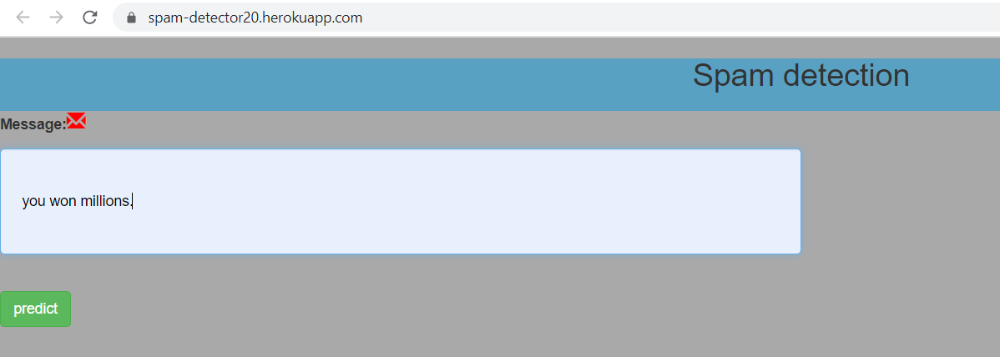
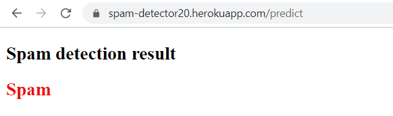

 
# Spam Detection 

Simple spam detection app integarted with Flask and deployed over heroku.

URL : https://spam-detector20.herokuapp.com/


Project summary : 

==============================================================================

The goal of this was to a spam detection model in python to automatically classify 
a message as either spam or ham(legitimate messages).
Hosting on Heroku using Flask (a lightweight web application framework).

=============================================================================






# Contents

* ```app.py``` - Front and back end portion of the web application excluding css and static data
* ```Assets Folder```  - css files and static images
* ```models``` - it contains script for extarcting data from yahoo finannce and fbprophet prediction.
* ```src```- conatins stock file extracted from yahoo finance
* ```out```- contains final predicton file.

#  Source  : 

https://towardsdatascience.com/a-simple-guide-for-deploying-a-spam-detector-onto-google-cloud-ab1cd7163a21

Kdnugget Blog,


